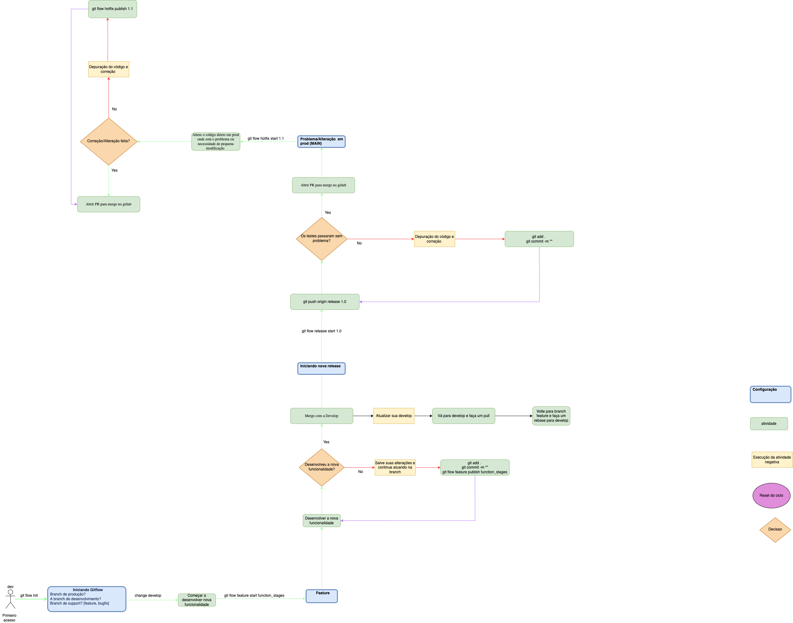

# Iguá Auth
## _Api de autenticação da Iguá Saneamento_

Igua auth realiza o processo de autenticação de rotas a partir do uso do Azure AD B2C como serviço acoplado que permite o uso de single sign-on e login social.

## Ferramentas e linguagem

A Api foi construída em node js (javascript) e express. Para a visualização de documentação das rotas foi usado o *swagger* que é disponibilizado em um *endpoint* específico `/doc` e que permite consultar todos as rotas disponíveis para uso. Para organizar o projeto utilizou-se o husky, eslint, prettier, commitlint e commitizen. A estrutura do projeto **deve** seguir o seguinte padrão:

    src
    │   app.js # Inicializador do projeto (ponto de partida)
    └───api
	    └───controllers # Funções da controllers do express route
	    └───models # Modelos do banco de dados
	    └───services # Regras de negócio
	    └───subscribers # Eventos async
	    └───repositories* # Query builders
    └───config # Configuração das variaveis de ambiente
    └───jobs # Tarefas de rotinas
    └───node_modules # Modulos utilizados no app
    └───utils # Trechos de código pequeno
    └───helpers # Trechos de arquitetura de código
    └───types # Tipagem (d.ts) para Typescript

## Comandos para inicialização

Após clonar o projeto, para instalar os módulos externos execute o comando:

    yarn install

ao término, é necessário criar um arquivo com o nome `.env` na raiz do projeto contendo as seguintes chaves obtidas no Azure Ad B2C:

    CLIENT_ID
    TENANT_ID
    CLIENT_SECRET
    REDIRECT_ROUTE
    AUTHORITY

Feito isso, o projeto já pode ser dado *start* com o comando `yarn dev` que fará com que o *nodemon* escute na porta selecionada para cada mudança feita em código sem que precise *restartar* o server novamente. 

Para *debug*, ao utilizar o *vscode* (recomendado), acione o a tecla `F5` que inicializará o processo automaticamente no editor de código.

## Commits

O processo de *commit* é padronizado pela lib `commitlint` e auxiliado pela lib `commitizen`. Para realizar um commit, **não** utilizar o comando `git commit -m "..."`, mas sim o seguinte comando apenas:

    yarn commit

Ao fazer isso, o terminal abrirá opções com diálogos para criar o *commit* de forma padronizada como o `commitizen`.

## Swagger autogen

Para atualizar a documentação do swagger, é necessário executar o comando:

    node swagger-autogen

## Gitflow

Para a realização do projeto, foi padronizada o *gitflow* com a lib cli externa chamada [cheatsheet do git-flow](https://danielkummer.github.io/git-flow-cheatsheet/index.pt_BR.html). É possível entender o seu funcionamento de forma rápida lendo a sua documentação. O padrão adotado para a criação das *branches* então foi definido como `Id da task no Jira-nome-da-task`, sendo o nome da task todo em *lowercase* e *kebabcase*. Todos os padrões da lib cheatsheet foram utilizados e se encontram entre os módulos do projeto a ser instalado. Não é necessário instalá-lo globalmente. 
### Desenho do fluxo



## Azure AD B2C

### Maneiras de Desenvolver o sistema de autenticacao

#### Azure AD B2C Authentication

É a forma mais segura atualmente de estruturar o barramento pelo Azure AD B2C, 
visto que você utiliza a estrutura que a própria Microsoft disponibiliza.

#### OAuth 2.0 Implict Flow

O OpenID Connect (OIDC) é um protocolo de autenticação aberto que cria perfis e estende o OAuth 2.0 para adicionar uma camada de identidade . O OIDC permite que os clientes confirmem a identidade de um usuário final usando autenticação por um servidor de autorização.

#### OAuth 2.0 Device Flow
A plataforma de identidade da Microsoft oferece suporte à concessão de autorização de dispositivo , que permite que os usuários entrem em dispositivos com restrição de entrada, como smart TV, dispositivo IoT ou impressora. Para habilitar esse fluxo, o dispositivo faz com que o usuário visite uma página da Web em seu navegador em outro dispositivo para fazer login. Depois que o usuário fizer login, o dispositivo poderá obter tokens de acesso e atualizar tokens conforme necessário.

##### OAuth 2.0 ROPC

A plataforma de identidade da Microsoft oferece suporte à concessão de ROPC (credenciais de senha de proprietário do recurso) OAuth 2.0, que permite que um aplicativo entre no usuário manipulando diretamente sua senha. Este artigo descreve como programar diretamente no protocolo do seu aplicativo.

**OBS:** `A Microsoft recomenda que você não use o fluxo ROPC. Na maioria dos cenários, alternativas mais seguras estão disponíveis e são recomendadas. Esse fluxo requer um alto grau de confiança no aplicativo e carrega riscos que não estão presentes em outros fluxos.`


## Code Review
### Abrindo PR com a Feature

* **Primeiro é feito o commit localmente**
```shell
git add . 
yarn commit
git push origin feature/...

```
* **Após o push deve ser aberto a PR**

1. Acesse merge request
2. Selecione as branchs e clique em compare
3. Coloque para aprovar o membros da sua squad, outro desenvolvedor ou arquiteto

### Fluxo da PR

1. Alterou localmente

2. Subiu com as alterações com push

3. Abriu o PR

4. Colocar alguém que não te ajudou a desenvolver a funcionalidade para aprovar

# Estrutura do framework cypress

<p >
    
 </p>


## 1. Integration/spec/.feature:Gherkin

### **Padrão do Gherkin**

  **Given**: Pré-condição, descreve o contexto inicial do cenário,
    para introduzir as ações do cenário.
  O Given não é utilizado para executar ações, apenas colocar em
  um estado conhecido do sistema.

  **Exemplo**
  ~~~gherkin
    Scenario Outline: Filtrar produtos no painel de produtos
      Given efetue login com "standard_user"
  ~~~

  **When**: Etapa do cenário que descreve um evento ou ação. Podendo
  ser uma interação com elemento do sistema, ou um evento acionado
  poro outro sistema.

  **Exemplo**

~~~gherkin
  When filtrar os produtos por "<filtro>"
~~~

  **And**: Maneira para substituir o When, o Given, quando estes tiverem repetições. É para tornar o cenário mais fluído com a substituição de repetição de outros passos.

  **Exemplo**

~~~gherkin
When filtrar os produtos por "<filtro>"
And selecionar o filtro de ordenação
~~~

  **Then**: Utilizado para descrever o resultado esperado do cenário.
  A escrita do Then deve ser como uma afirmação para comparar o resultado,
  real, *que o sistema gerou*, com o resultado esperado *que deveria gerar*.
  *Um resultado deve ser uma saída observável . Ou seja, algo que vem de fora do sistema (relatório, interface de usuário, a mensagem)*

  **Exemplo**

~~~gherkin
    Then deve exibir o produto com nome "Bolsa Av" e preço "R$ 54.55"
~~~
<br>

**background**: O background é a maneira de contextualizar os cenários. Se você observou que há muita repetição de algum step,
 o background pode ser útil, para introduzir o contexto ao cenário. 


  **Exemplo**

~~~gherkin
      Background: Iniciar na página de exemplo
        Given o acesso a plataforma

~~~
<br>


**Case de uma loja**

~~~gherkin
  Feature: Filtrar produtos pelo nome e preços

    Background: Iniciar na página de exemplo
      Given o acesso a plataforma

     @test
    Scenario Outline: Filtrar produtos no painel de produtos
      Given efetue login com "standard_user"
      When filtrar os produtos por "Maior preço"
      And selecionar o filtro de ordenação
      Then deve exibir o produto com nome "Bolsa Av" e preço "R$ 54.55"
~~~

<br>


 ## 2. steps

<br>

 * **arquivo com extensão Step**:
    - é o padrão para o cypress consiga monitorar esse arquivo
      se o nome da pasta é steps, o arquivo deve ter steps também.
    - Cada arquivo steps está integrado ao pageObject: loginSteps; panelSteps

<br>


**Padronização:**

<br>


`Aspas duplas:` para textos com parâmetros
`Aspas simples:` textos sem parâmetro

~~~javascript
import
import {Before, Given, And} from 'cypress-cucumber-preprocessor/steps'
import {LoginPage} from '../pageObject/pages/LoginPage'


Given(`o acesso a plataforma`, () => {
	LoginPage.acessar_sauce_demo();

});

~~~

  * **common**:
    - hook para controlar as condições que ocorrem antes e depois de cada test

<br>


## 3. components

* **componentes**:
    - todos os seletores por meio de classes
    - Cada classe representa a relação de elementos de uma página

**LoginElement**

~~~javascript
  export class LoginElement{

    static input = (campValue) => `[data-test=${campValue}]`

}
~~~

<br>


## 4. pageObject

* **pages**:
  - representa o comportamento de cada página
  - cada arquivo representa uma classe da página

**LoginPage.js**
~~~javascript
import BasePage from './BasePage'
import {LoginElement} from '../components/LoginElement'

export class LoginPage extends BasePage{

    static acessar_sauce_demo(){
        cy.visit('/')
    }

}
~~~

<br>


## 5. utils
  * **utils**
    - Parte separada para criar libs, um arquivo uma responsabilidade.

<br>


# Configuração inicial


<br>


## 1. VSC
  **Plugins**
  * EditorConfig for VS Code
  * ESLint
  * Draw.io Integration
  * Cucumber (Gherkin)

<br>


## 2. instalações

 * yarn i 
 * yarn i --production

<br>


## 3. Verificação do ambiente
  * Criar um arquivo ou mudar a url do cypress/config/*.json
  * Coloco o nome do arquivo em cypress/plugin/index.js {module.exports --> file}

<br>

# Instalação e execução

  * Rodar em modo headless: `yarn cy:run`
  * Rodar em tela gráfica: `yarn cy:open`
  * Gerar o report HTML(sempre após rodar o cypress): `yarn run cy:report`
  * Limpar os reports: `yarn run cy:clean`

<br>

# Dependências:

  * [**Cypress**](https://www.cypress.io/)
  * [**Cypress-cucumber-preprocessor**](https://github.com/TheBrainFamily/cypress-cucumber-preprocessor)
  * [**Fs-extra**](https://www.npmjs.com/package/fs-extra)
  * [**Rimraf**](https://www.npmjs.com/package/rimraf)
  * [**Multiple-cucumber-html-reporter**](https://www.npmjs.com/package/multiple-cucumber-html-reporter)
  * [**Faker-br**](https://www.npmjs.com/package/faker-br)


<br>


# Como rodar o projeto pelo docker:

  * docker build -t <nome_da_imagem> .
  * Shell: docker container run --rm -it -e tags=@tag -v %cd%:/usr/src/e2e <nome_da_imagem>
  * Powershell: docker run -i -v "%cd%":/usr/src/e2e -t <nome_da_imagem> --spec cypress/integration/spec/*.feature
  * `O comando acima não funciona no Powershell devido aos dois pontos após %cd%`

  * [**Command**]: **yarn i --save-dev {package}**

# Configuração do steps do cucumber

<br>

 * package.json
 ~~~json
 "cypress-cucumber-preprocessor": {
    "nonGlobalStepDefinitions": false,
    "step_definitions": "cypress/steps",
    "cucumberJson": {
      "generate": true,
      "outputFolder": "reports/json"
    }
  }
 ~~~
 **ponto importante**:
 - "step_definitions": esse atributo irá definir onde estão os steps do projeto, que executam o arquivo em gherkin.
 - se você colocou o nome da pasta steps, os arquivos dentro dela terão que terminar com o {nome-do-arquivo}steps.js
